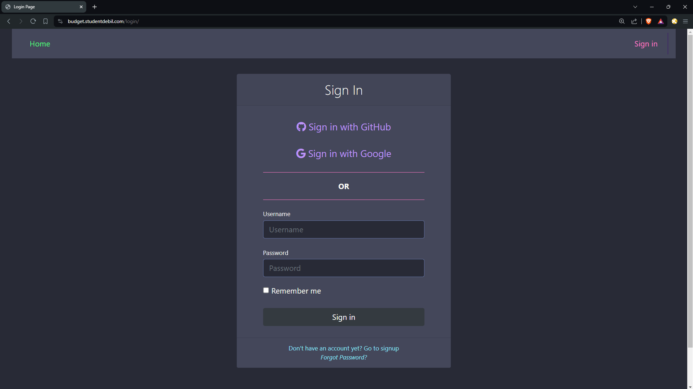
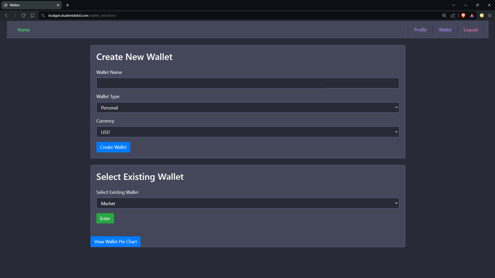
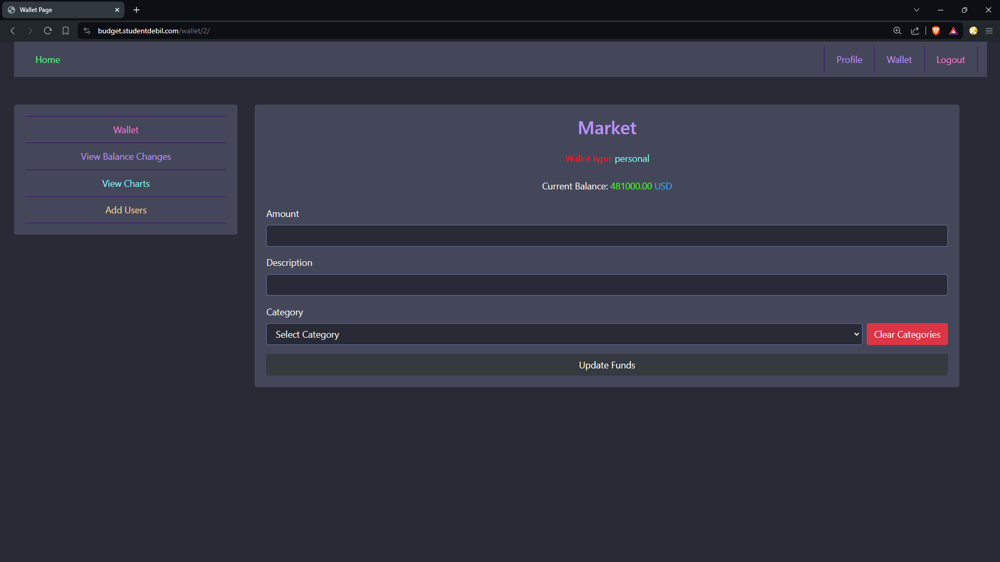
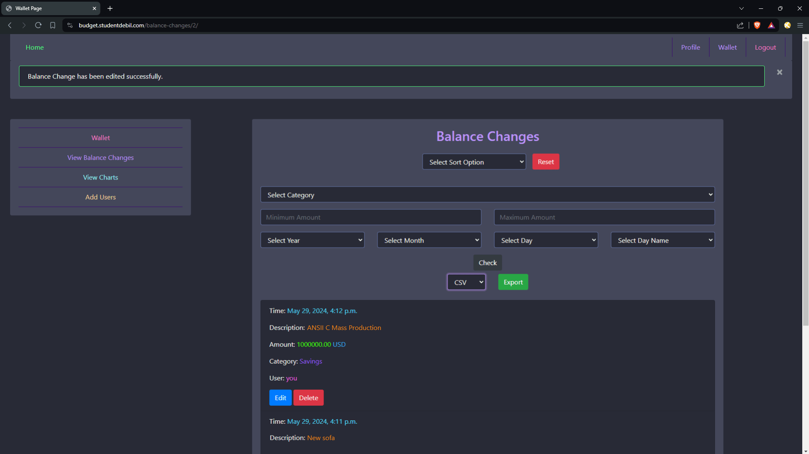
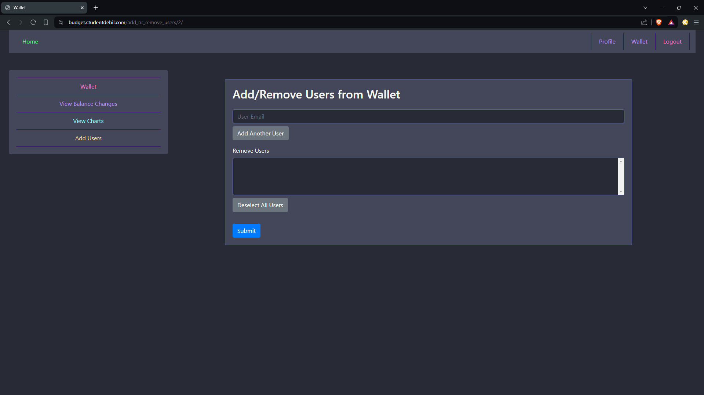
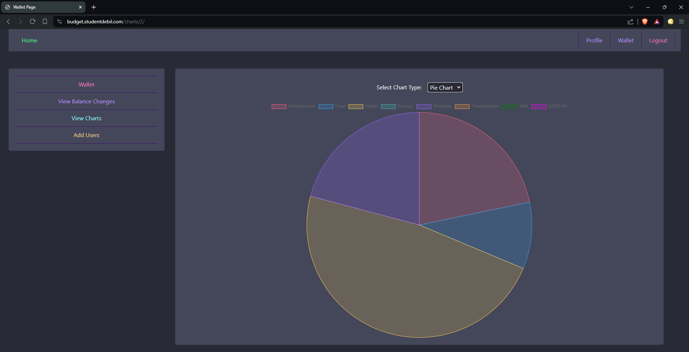
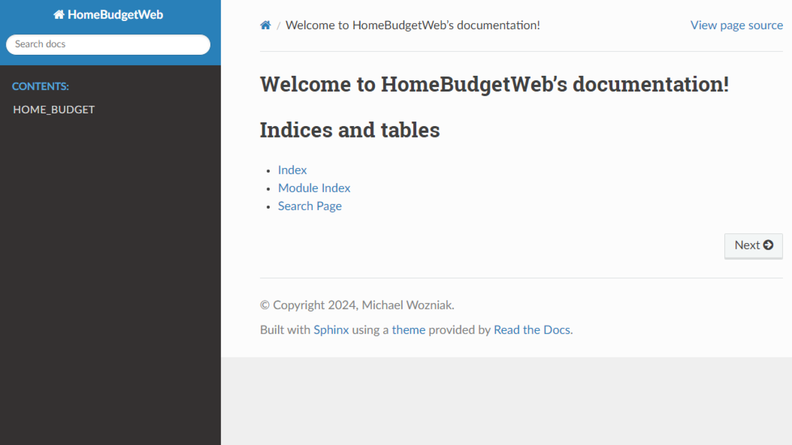
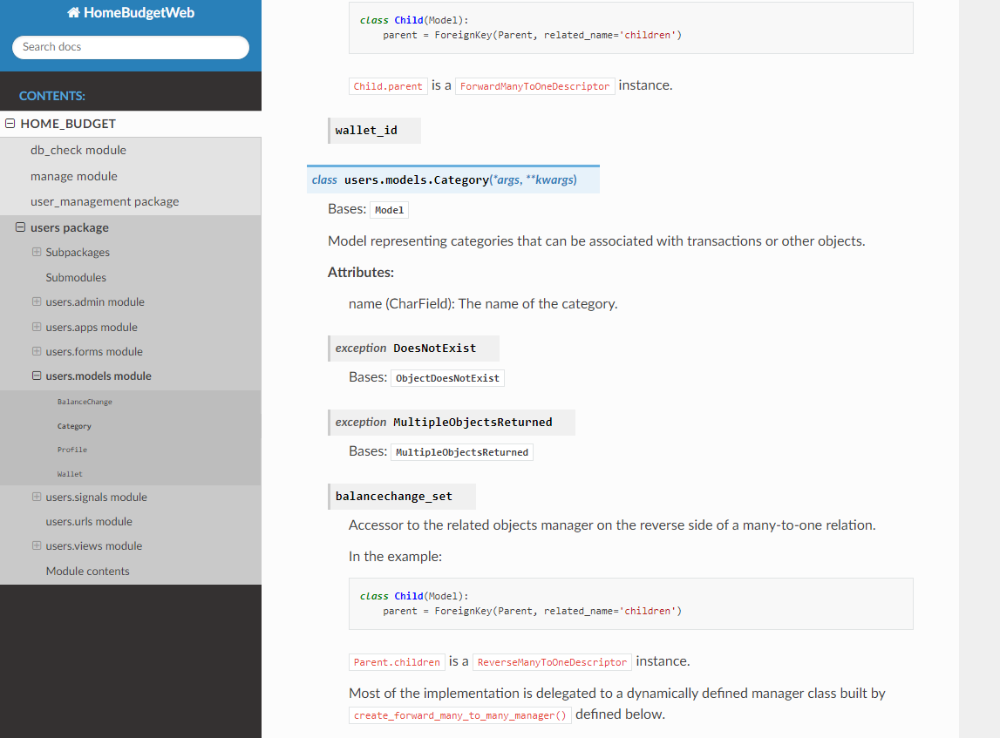

# 🎉 Django Home Budget Web App 🎉
College Project for managing funds and accounts with a register/login system, profile view, and OAuth.

## ✨ Current Features (24.06.2024) ✨
    
### 🔐 Log In Features:
- **Register** – Users can register and create a new profile.
- **Login** – Registered users can log in using their username and password.
- **Social Apps Login** – Users can log in using their GitHub or Google account.
- **User Profile** – Once logged in, users can create and update additional information such as avatar and bio on the profile page.
- **Update Profile** – Users can update their information such as username, email, password, avatar, and bio.
- **Remember Me** – Cookie option so users don’t have to provide credentials every time they visit the site.
- **Forgot Password** – Users can easily retrieve their password if they forget it.
- **Admin Panel** – Admins can create, read, update, and delete users.

### 💰 Wallet Features:
- **Update Funds** – Users can update funds in their wallet.
- **Edit or Delete Balance Change** – Users can edit the description or category, or even delete it.
- **Add or Remove Users** – Wallet creators can remove or add users to a group wallet.
- **Charts & Statistics** – Users can view wallet charts to see how funds are managed by each category.
- **Clear Balance History** – Ability to clear history.
- **Additional Features** – Various other features not specified.

The entire project is prepared and can be easily set up on a website. The provided screenshots demonstrate its functionality.

The project is configured to be built with Docker.
Automated documentation is generated using the Sphinx package.

If you need additional details or a different focus, please let me know!

## 📸 Screenshots:

<div style="text-align: center;">

### 🏠 Home View:


### 🔑 Log In View:


### 💼 Wallets View:


### 💳 Wallet View:


### 📊 Balance View:


### ➕➖ Add or Remove Users:


### 📈 Data Visualization:


### 📄 Docs Home View:


### 📊 Example of some documentation:


</div>

## ⚙️ Environment Variables

To run this project, you will need to add the following environment variables to your `.env` file. Ensure to set your own values for each variable:

```plaintext
# Django
SECRET_KEY="your_secret_key"
ALLOWED_HOSTS=localhost 127.0.0.1 0.0.0.0 [::1] *

# DataBase Settings
POSTGRES_DB=your_database
POSTGRES_USER=your_postgres_user
POSTGRES_PASSWORD=your_postgres_password
DB_ENGINE=django.db.backends.postgresql
DB_NAME=your_db_name
DB_USER=your_db_user
DB_PASSWORD=your_db_password
DB_HOST=localhost # change to 'db' if using Docker
DB_PORT=5432
DJANGO_ALLOWED_HOSTS=localhost
DJANGO_SUPERUSER_USERNAME=your_admin_username
DJANGO_SUPERUSER_EMAIL=your_admin_email
DJANGO_SUPERUSER_PASSWORD=your_admin_password

# SMTP
EMAIL_USER=your_email@gmail.com
EMAIL_PASSWORD=your_email_password

# Social auth configs for GitHub
SOCIAL_AUTH_GITHUB_KEY=your_github_key
SOCIAL_AUTH_GITHUB_SECRET=your_github_secret

# Social auth configs for Google
SOCIAL_AUTH_GOOGLE_OAUTH2_KEY=your_google_key
SOCIAL_AUTH_GOOGLE_OAUTH2_SECRET=your_google_secret
```
## 🛠️ Database Configuration
This project uses a PostgreSQL database configured using Railway. However, you can use any PostgreSQL instance you prefer. Ensure to update the database settings in the `.env` file accordingly.


Enjoy managing your budget with ease and clarity! 🚀
